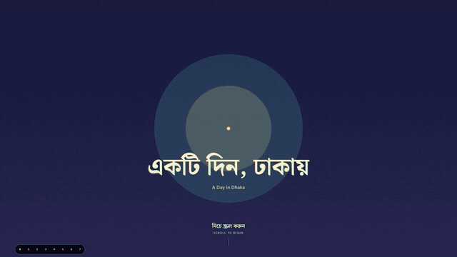

<div align="center">

<p><strong>DHAKA, BANGLADESH · 04:45—23:45</strong></p>

# A Day in Dhaka

<p lang="bn">একটি দিন, ঢাকায়</p>

### One city. One day. A cup of tea.

A scroll through the changing light, streets, and small rituals of Dhaka.<br>
From the first azaan on the Buriganga to the last pool of lamplight.

<p>
  <a href="#watch-the-day">Watch the day</a> ·
  <a href="#the-experience">The experience</a> ·
  <a href="#run-locally">Run locally</a> ·
  <a href="#inside-the-project">Explore the code</a>
</p>

<p>
  
  
  
  
</p>

</div>

## Watch the day

[](./docs/media/a-day-in-dhaka.mp4)

**[Watch the full video →](./docs/media/a-day-in-dhaka.mp4)** · 20.5 seconds · 1080p MP4

The preview above is a lightweight animation. Open the MP4 for the original recording and audio.

## The experience

**A Day in Dhaka** is an illustrated, scroll-driven story. A recurring tea glass connects eight scenes as the city moves from blue dawn through warm morning, the rush of traffic, and neon evening to a quiet street at night.

- **You set the pace.** Scroll-linked timelines carry the story forward and backward; an on-screen clock follows the day.
- **Two languages, one story.** Bangla headlines and English subtitles share each scene.
- **Light tells the time.** A shared palette shifts the sky, illustrations, and typography as the day unfolds.
- **Motion adapts.** Reduced-motion support, lazy-loaded scenes, and device-aware effects keep the experience accessible across devices.

### A city in eight scenes

| Scene | Time | Setting |
| :--- | :--- | :--- |
| **00 · Sunrise Dot** | Before dawn | A single point of light opens the story. |
| **01 · Azaan on the Buriganga** | 4:45 AM | River, boats, mist, and the waking skyline. |
| **02 · Old Dhaka Wakes** | 7:00 AM | A tea stall and the warmth of morning. |
| **03 · The Rush** | 9:00 AM | Traffic, crowds, and a city in motion. |
| **04 · Noon Heat** | 1:00 PM | The day slows under the afternoon sun. |
| **05 · Golden Hour** | 4:30 PM | Rooftops, pigeons, and the evening sky. |
| **06 · Neon Evening** | 7:30 PM | City lights and scroll-responsive trails. |
| **07 · Quiet City** | 11:45 PM | A resting street and one warm lamp. |

Read the [story script](./SCRIPT.md) for the scene direction and tea-glass continuity.

## Built with

| Layer | Tools | Purpose |
| :--- | :--- | :--- |
| Application | Next.js 16 App Router · React 19 · TypeScript | Page shell, metadata, and scene components |
| Styling | Tailwind CSS 4 · CSS custom properties | Responsive layouts and time-of-day color tokens |
| Motion | GSAP · ScrollTrigger · Lenis | Scene timelines and smooth scrolling |
| Illustration | Inline SVG · Canvas 2D | City artwork, recurring characters, and the pigeon flock |
| Light effects | Three.js · React Three Fiber · drei · GLSL | Enhanced evening trails on supported devices |
| Typography | Noto Serif Bengali · Hind Siliguri · Baloo Da 2 | Bengali display text, subtitles, and the clock |

## Run locally

Use **Node.js 24** and **npm** to run the app and its tests. The application requires Node.js **20.9+**; the tests import TypeScript directly and use Node's native type stripping.

```bash
git clone https://github.com/Shahriar-Dev27/A-day-In-Dhaka-City-.git a-day-in-dhaka
cd a-day-in-dhaka
npm ci
npm run dev
```

Open [localhost:3000](http://localhost:3000), then scroll to begin. Development mode includes scene-jump controls for inspecting individual scenes.

| Command | Action |
| :--- | :--- |
| `npm run dev` | Start the development server |
| `npm run build` | Create the production build |
| `npm run start` | Serve the production build after building |
| `npm run lint` | Run ESLint |
| `npx tsc --noEmit` | Check TypeScript types |
| `npm test` | Check scene timing, palettes, and text contrast |

Fonts are downloaded through `next/font/google` at build time and served locally at runtime. A fresh build needs access to Google Fonts.

For production, set `NEXT_PUBLIC_SITE_URL` to the site's public origin so social metadata uses the correct URL. On Vercel, `VERCEL_PROJECT_PRODUCTION_URL` is used as a fallback.

## Inside the project

<details>
<summary><strong>Architecture and file map</strong></summary>

```text
app/                      Page shell, metadata, styles, and error pages
components/
  Experience.tsx          Scene loading, master sky timeline, and clock
  ClockProgress.tsx       Scroll-linked time display
  Loader.tsx              Initial loading state
  scenes/
    Scene0Intro.tsx       Opening title
    Scene1Azaan.tsx …     Individual story scenes through midnight
    scene-kit.tsx         Shared scene layout and timeline behavior
    story-kit.tsx         Recurring characters and tea-glass artwork
    PigeonSwarm.tsx       Canvas 2D flock
    LightTrails.tsx       Evening shader wrapper
lib/
  scenes.ts               Scene registry, scroll offsets, and clock mapping
  palette.ts              Scene palettes and shared color tokens
  scroll.ts               Lenis and ScrollTrigger coordination
  gsap.ts                 Animation setup and motion preferences
  device.ts               Device-tier detection
  fonts.ts                Bengali and Latin font configuration
shaders/lightTrail.ts     Evening light-trail shader
tests/lib.test.mjs        Shared contract and contrast checks
docs/assets.md           Asset sources and licence log
docs/media/              README walkthrough and animated preview
SCRIPT.md                 Story and scene direction
```

Each scene owns its animation timeline. Shared scene metadata controls scroll length and clock anchors; palette tokens drive the changing sky. Scenes beyond the introduction and dawn load as they approach the viewport.

To inspect the lighter rendering path, open [localhost:3000/?tier=low](http://localhost:3000/?tier=low). Enable reduced motion in your operating system or browser to inspect the motion-reduced experience.

</details>

---

<div align="center">

Designed and built by **[Shahriar Islam Dip](https://github.com/Shahriar-Dev27)**.<br>
Illustration and shader work are original to this project.<br>
See the [asset and licence log](./docs/assets.md) for sources and attribution.

</div>
